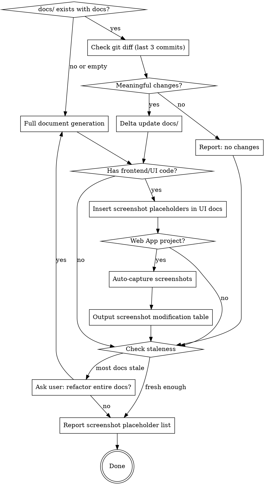

# Document

Generate or incrementally update project documents from the codebase into `docs/`.

## Decision Flow



## Hard Rules (non-negotiable)

1. **AI-reimplementable fidelity.** Every doc must be detailed enough that another AI agent, given *only* the docs folder, can re-implement the entire project from scratch without reading the original source code.

2. **Output directory is `docs`.** All generated documents live under `docs/`.

3. **Chinese-only (简体中文).** All document filenames, directory names, and document content must use Simplified Chinese. No English names for files or folders.

4. **Numbered folder and file convention.** Every directory and file under `docs/` (except the root `README.md`) must follow the `{序号}_{中文名称}` format. Use zero-padded two-digit numbers (`01`, `02`, …). This applies to all levels: top-level category folders, sub-folders, and individual `.md` files.

5. **Delta-only when possible.** If `docs/` already contains detailed documentation, do NOT regenerate from scratch. Use git diff to detect changes and update only affected documents.

6. **Preserve manual edits.** When updating an existing doc file, preserve manually written sections. Only update content that corresponds to changed source code.

7. **No source code in docs.** Never include raw source code (no code blocks with implementation). Use mermaid diagrams for logic flow, and natural language for module/function descriptions. The doc describes *what* and *why*, never the literal *how* of the code.

8. **Modification history on every doc.** Every document under `docs/` must begin with a modification history table (see Modification History format below).

9. **Screenshot placeholders for frontend UI modules.** When documenting frontend/UI modules (pages, components, views with visual output), insert screenshot placeholders at key UI interaction points. Each placeholder MUST be followed by a markdown image link pointing to the `截图/` directory at the same directory level. After generating docs for a Web App project, auto-capture screenshots using Chrome DevTools MCP.

## Prerequisites

This skill depends on the **everything-claude-code** plugin:

```
/plugin marketplace add https://github.com/affaan-m/everything-claude-code
/plugin install everything-claude-code@everything-claude-code
```

**For auto-capture of screenshots**, the **chrome-devtools-mcp** plugin is required:

```
/plugin install chrome-devtools-mcp@chrome-devtools-mcp
```

## Modification History Format

Every document file under `docs/` must include a modification history table at the very beginning (after any YAML frontmatter, before the main heading). Use this exact format:

```markdown
## Modification History

| Time | Version | Description | Operator |
|------|---------|-------------|----------|
| 2026-05-20 10:30 | v1.0.0 | Initial documentation generated | ATreep |
| 2026-05-21 14:15 | v1.1.0 | Added error handling flow to data-pipeline module | ATreep |
```

Rules for the history table:
- **Time**: ISO date + time of the modification (`YYYY-MM-DD HH:MM`).
- **Version**: Semantic version (`MAJOR.MINOR.PATCH`). MAJOR for doc rewrites, MINOR for new sections/modules, PATCH for fixes and clarifications.
- **Description**: Brief one-line summary of what changed.
- **Operator**: Git username of the person who made the change. Obtain via `git config user.name` or `git log -1 --format='%an'`. If no git username is available, use the system username.
- On every delta update, append a new row to the table. Never remove or modify existing rows.

## Docs Directory Structure

The docs directory uses a numbered Chinese folder hierarchy, organized by domain category at the top level and by module at the detail level:

```
docs/
├── README.md                                       # 导航索引（不含序号前缀）
├── 01_产品需求文档/
│   └── 01_产品需求文档.md                            # PRD：系统概述、能力清单、用户故事、非功能需求
├── 02_核心业务流程/
│   └── 01_核心业务流程.md                            # 端到端业务流程与数据/控制流
├── 03_系统架构与开发/
│   ├── 01_系统架构概述.md                            # 系统结构、边界、技术栈、模块间交互
│   ├── 02_数据模型.md                                # 存储模式、实体、关系（mermaid ER 图）
│   └── 03_模块集成.md                                # 第三方 API/服务及交互契约
├── 04_运行时与部署/
│   ├── 01_运行时环境.md                              # 环境配置、启动脚本、执行模型
│   └── 02_部署与运维.md                              # 部署/运行手册、健康检查、故障/回滚路径
├── 05_实现指南/
│   ├── 01_端到端重建蓝图.md                           # 从零重建的完整实现指南
│   └── 02_模块目录.md                                # 模块目录及覆盖率矩阵
└── 06_模块详细设计/
    ├── 01_认证模块/                                   # 示例：认证模块
    │   ├── 01_模块概述.md                             # 模块职责、设计目标、已知缺陷
    │   ├── 02_登录流程.md                             # 登录子模块 doc
    │   ├── 03_令牌管理.md                             # 令牌子模块 doc
    │   ├── 04_会话处理.md                             # 会话子模块 doc
    │   └── 截图/                                      # 截图目录（与 doc 文件同级）
    │       ├── 1-login-page.png
    │       └── 2-login-error.png
    ├── 02_数据管道/
    │   ├── 01_模块概述.md
    │   ├── 02_数据摄取.md
    │   ├── 03_数据转换.md
    │   └── 04_数据导出.md
    └── 03_用户界面/
        ├── 01_模块概述.md
        ├── 02_仪表盘.md
        ├── 03_设置.md
        └── 截图/                                      # 用户界面模块的截图目录
            ├── 1-dashboard-overview.png
            └── 2-settings-page.png
```

### Folder and File Naming Rules

- **Top-level category folders**: `{序号}_{中文类别名}/` directly under `docs/`. Sequence determines the reading order. Categories should cover: product requirements, business flows, architecture, runtime/deployment, implementation guide, and module details.
- **Module folders**: `{序号}_{中文模块名}/` under `06_模块详细设计/`. Module name derived from domain responsibility (e.g., `01_认证模块`, `02_数据管道`).
- **Individual doc files**: `{序号}_{中文文件名}.md` inside their respective folders. Sequence by logical reading order.
- The root `README.md` is the only file without a numeric prefix — it serves as the navigation index.
- Each module folder MUST contain a `01_模块概述.md` (module overview, design objectives, known flaws).
- Sub-modules become additional numbered `.md` files in the same module folder.
- If a sub-module is complex enough, it can become a sub-folder (nested hierarchy uses the same `{序号}_{中文名}` convention).
- **No English names** for any file or directory under `docs/`.
- **Screenshot directory**: `截图/` placed at the same level as the `.md` files that reference them. Each module folder that has frontend UI content gets its own `截图/` subdirectory.

## Screenshot Placeholders for Frontend UI

### When to Insert Placeholders

Screenshot placeholders are required when documenting modules that have **visual user interfaces**. This includes:

- Web frontend pages (HTML, React, Vue, Angular components)
- Mobile app screens (SwiftUI, Jetpack Compose, Flutter widgets)
- Desktop app windows (Electron, Qt, WinForms)
- CLI/TUI interactive interfaces
- Any module under `06_模块详细设计/` that renders a visual output

Placeholders are NOT needed for:
- Backend API modules (no visual interface)
- Data processing pipelines (no UI)
- Library/utility modules (no UI)
- Configuration/infrastructure modules (no UI)

### Placeholder Format

Use this exact format — each placeholder MUST be followed by a markdown image link pointing to the `截图/` directory:

```
【图X：[界面/组件名称] - [界面状态描述]，展示[具体UI元素列表]】


```

The image filename uses the pattern `X-descriptive-name.png` or `Xa-descriptive-name.png` where:
- `X` is the sequential figure number (starting from 1, numbering within each `.md` file)
- `a`, `b`, `c` (optional letter suffix) indicates scroll position variant of the same page: `a` = top/initial viewport, `b` = middle or lower section, `c` = bottom. Omit the suffix for pages captured in a single viewport.
- `descriptive-name` is a short English slug describing the screenshot

Examples:
- `【图1：登录页面 - 默认状态，展示系统Logo、用户名输入框、密码输入框、登录按钮、忘记密码链接的整体布局】` followed by ``
- `【图2a：仪表盘主页 - 页面上半部分（初始视口），展示顶部导航栏、左侧菜单、统计卡片区域】` followed by ``
- `【图2b：仪表盘主页 - 页面下半部分（滚动后），展示最近数据表格、活动日志列表、页脚信息】` followed by ``
- `【图3：用户设置页面 - 编辑状态，展示头像上传区域、昵称输入框、邮箱修改表单、保存按钮】` followed by ``

### Screenshot Count Guidelines

Base counts (before scroll variants):

| UI Scope | Base Screenshot Count |
|----------|-----------------|
| Small (1-3 pages/views) | 3-6 screenshots |
| Medium (4-10 pages/views) | 6-15 screenshots |
| Large (11+ pages/views) | 15-25 screenshots |

**Scroll multiplier**: For each page whose content extends beyond 1.5× viewport height, add 1-2 extra screenshots to cover scroll positions (see Scroll Position Coverage above). The total count per module doc should reflect: `base_count + scroll_variants`.

Example: A medium project with 6 pages, 3 of which are long/scrollable → 10-18 base + 3-6 scroll variants = 13-24 total screenshots.

Priority for screenshots in architecture docs:
1. Main page / entry view (logged-in and logged-out states)
2. Core feature pages (main interaction views, **covering full page content across multiple scroll positions if needed**)
3. Scroll-depth coverage for long pages — capture top, middle, and bottom sections to document full page layout
4. Key interaction states (form validation, loading, empty, error states)
5. Complex dialogs or modals
6. Data visualization or result views
7. Navigation structure (menu, breadcrumb, tab switching)
8. Settings/configuration pages

### Scroll Position Coverage

Architecture documentation must capture the **complete layout** of each page. A single viewport screenshot cannot capture long/scrollable pages. For any page whose content extends beyond one viewport height, capture multiple screenshots at different scroll positions.

**When to capture multiple scroll positions:**
- Page content height > 1.5× viewport height → Capture at least 2 screenshots (top + bottom)
- Page content height > 3× viewport height → Capture at least 3 screenshots (top + middle + bottom)
- Page has distinct layout sections separated by scroll (e.g., hero section → feature grid → footer) → Capture one per major section
- Dashboard or data pages with multiple widget/grid rows → Capture each logical row group

**Scroll position naming convention:**
Use letter suffixes (`a`, `b`, `c`) after the figure number for scroll variants of the same page:

```
Xa-descriptive-name.png  → 页面上半部分（初始视口）
Xb-descriptive-name.png  → 页面下半部分（滚动后）或中部
Xc-descriptive-name.png  → 页面底部（进一步滚动后）
```

Example for a long dashboard page:
```
【图2a：仪表盘主页 - 页面上半部分（初始视口），展示顶部导航栏、左侧菜单、统计卡片区域】


【图2b：仪表盘主页 - 页面下半部分（滚动后），展示最近数据表格、活动日志列表、页脚信息】

```

**Single-page screenshots (no scroll variants):**
For short pages whose entire content fits within one viewport (e.g., login page, simple form), use a single numbered placeholder without letter suffix:
```
【图1：登录页面 - 默认状态，展示Logo、输入框、按钮布局】

```

**fullPage capture alternative:**
For pages where scroll segmentation is impractical (e.g., very long continuous content), use `fullPage: true` in Chrome DevTools MCP to capture the entire page in one screenshot. This is acceptable for architecture docs but less preferred than segmented captures, as fullPage screenshots may be too tall to read comfortably.

### Screenshot Table in Doc File

At the end of each `.md` file that contains screenshot placeholders, append a screenshot inventory table:

```
## 截图清单

| 序号 | 所在章节 | 截图描述 | 文件名 |
|------|---------|---------|--------|
| 图1  | 登录流程 | 登录页面默认状态，展示Logo、输入框、按钮布局 | 截图/1-login-page.png |
| 图2  | 登录流程 | 登录失败状态，展示错误提示信息 | 截图/2-login-error.png |
| 图3a | 仪表盘主页 | 页面上半部分（初始视口），展示顶部导航栏、统计卡片区域 | 截图/3a-dashboard-top.png |
| 图3b | 仪表盘主页 | 页面下半部分（滚动后），展示数据表格、活动日志 | 截图/3b-dashboard-bottom.png |
```

## Core Rules

- Prefer multiple focused files over a single large file.
- Cover **all code modules** in scope: `.py`, `.html`, `.js`, `.ts`, `.tsx`, `.jsx`, `.java`, `.sh`, `.go`, `.rs`, `.php`, `.rb`, `.cs`, `.kt`, `.swift`, `.sql`, `.yaml`, `.yml`.
- Documentation must be detailed enough that Claude Code can implement the full project from docs alone.
- Derive docs from source-of-truth files and code; avoid inventing behavior.
- Use `everything-claude-code:plan` to draft a plan before your actions.
- **No source code** — represent logic with mermaid diagrams (flowchart, sequence, class, state, ER) and describe behavior in natural language. Pseudocode is acceptable only for complex algorithms where natural language alone is ambiguous.

## Mode 1: Full Document Generation (no existing docs/)

Run when `docs/` does not exist or is empty.

### Workflow

1. **Inventory the codebase**
   - Identify project type(s), runtimes, entry points, module boundaries, and infra files.
   - Build a complete module index for all relevant source files in scope.
   - Map modules to a numbered sub-folder hierarchy under `docs/06_模块详细设计/`.
   - **Detect frontend/UI code**: Identify modules that contain visual user interfaces (see "When to Insert Placeholders" above).

2. **Map architecture and behavior**
   - Trace request/data/control flow across layers.
   - Capture dependencies, external services, config/env requirements, scripts/commands, and operational behavior.
   - Represent all flows as mermaid diagrams.
   - For frontend/UI modules, additionally map the visual layout: pages, components, their states, and user interaction flows.

3. **Generate `docs/` set**
   - `docs/README.md` — 导航索引
   - `docs/01_产品需求文档/01_产品需求文档.md` — 产品需求文档（详见下方 PRD 要求）
   - `docs/02_核心业务流程/01_核心业务流程.md` — 端到端业务流程与数据/控制流（mermaid 图）
   - `docs/03_系统架构与开发/01_系统架构概述.md` — 系统结构、边界、技术栈、模块间交互（mermaid 图）
   - `docs/03_系统架构与开发/02_数据模型.md` — 存储模式、实体、关系（mermaid ER 图）
   - `docs/03_系统架构与开发/03_模块集成.md` — 第三方 API/服务及交互契约
   - `docs/04_运行时与部署/01_运行时环境.md` — 环境配置、启动脚本、执行模型
   - `docs/04_运行时与部署/02_部署与运维.md` — 部署/运行手册、健康检查、故障/回滚路径
   - `docs/05_实现指南/01_端到端重建蓝图.md` — 从零重建的完整实现指南
   - `docs/05_实现指南/02_模块目录.md` — 模块目录及覆盖率矩阵
   - `docs/06_模块详细设计/` — 模块详细设计根目录
   - `docs/06_模块详细设计/{序号}_{模块名}/01_模块概述.md` — 每个模块的概述
   - `docs/06_模块详细设计/{序号}_{模块名}/{序号}_{子模块名}.md` — 每个子模块或功能一个文件

4. **Insert Screenshot Placeholders**
   - For every frontend/UI module doc file, insert screenshot placeholders at key UI interaction points (see Screenshot Placeholder Format).
   - Place placeholders after the natural language description of each page/view/component, before the next section.
   - **For long/scrollable pages**: Insert multiple placeholders covering different scroll positions (see Scroll Position Coverage above). Use `Xa`, `Xb`, `Xc` letter suffixes for scroll variants of the same page.
   - Create the `截图/` subdirectory in each module folder that has frontend UI content.
   - Append the screenshot inventory table at the end of each doc file that contains placeholders.

5. **PRD Requirements**

   The `docs/01_产品需求文档/01_产品需求文档.md` must contain:

   - **System Overview**: What the system does, who uses it, and why it exists.
   - **Capabilities**: High-level list of everything the system can do, organized by module.
   - **Module Design Objectives**: For each module in `docs/06_模块详细设计/`, document:
     - What problem it solves.
     - What it was designed to achieve.
     - Known design flaws, limitations, or trade-offs.
   - **User Stories / Use Cases**: Key scenarios the system supports.
   - **Non-Functional Requirements**: Performance, security, scalability constraints.
   - **Out of Scope**: Explicitly list what the system does NOT do.

6. **Per-module documentation requirements**

   Each module sub-folder (`docs/06_模块详细设计/{序号}_{模块名}/`) must include:

   - `01_模块概述.md` with:
     - Module responsibility and scope.
     - Design objectives and known flaws.
     - Dependencies on other modules.
     - Modification history table.
   - One `.md` per sub-module or feature (e.g., `02_登录流程.md`, `03_令牌管理.md`), each containing:
     - File path(s) and responsibility.
     - Public interfaces (functions/classes/endpoints/CLI commands) — described in natural language, not code.
     - Inputs/outputs, side effects, and invariants.
     - Internal dependencies and call relationships (mermaid sequence/flowchart diagrams).
     - Error handling and edge cases.
     - Security considerations and validation boundaries.
     - Reimplementation notes (what must be preserved for parity).
     - Modification history table.
     - **For frontend/UI sub-modules**: Screenshot placeholders at key visual states, and a screenshot inventory table at the end.

7. **Logic Representation (mermaid)**

   Use mermaid diagrams to represent all logic. Required diagram types:

   | Logic Type | Mermaid Diagram |
   |------------|----------------|
   | Request/data flow | `flowchart TD` or `flowchart LR` |
   | Component interactions | `sequenceDiagram` |
   | Data entities & relationships | `erDiagram` |
   | State machines | `stateDiagram-v2` |
   | Class/module structure | `classDiagram` |
   | System boundaries | `flowchart` with subgraphs |

   Every module overview must include at least one flowchart showing the module's internal flow.

8. **Auto-Capture Screenshots (Web App projects)**

   After generating docs with screenshot placeholders, if the project is a Web App, auto-capture screenshots. See "Auto-Capture Screenshots with Chrome DevTools MCP" section below for the complete workflow.

9. **Coverage validation**
   - Produce a coverage matrix in `docs/05_实现指南/02_模块目录.md` mapping every discovered source module to a documentation target folder.
   - Explicitly list any skipped/generated/vendor files and the reason.
   - If coverage is incomplete, continue until all in-scope modules are documented.

10. **Staleness and provenance**
    - Add generated markers and scan metadata (date, scope, files scanned).
    - Preserve manually written sections when updating existing docs.

11. **Final summary**
    - Report created/updated files in `docs`.
    - Report module coverage totals and any intentional exclusions.
    - **Report screenshot placeholder locations** (see "Screenshot Placeholder Report" below).

## Mode 2: Delta Update (docs/ already exists)

Run when `docs/` exists with detailed documentation.

### Workflow

1. **Detect Changes (git diff, last 3 commits)**

   ```bash
   git diff HEAD~3..HEAD --name-status
   ```

   - Focus on source files only. Ignore non-source files (`.md`, `.gitignore`, lock files, config files that don't affect behavior).
   - If there are also uncommitted changes, include them: `git diff HEAD --name-status`.
   - Default depth is 3 commits. User can override by passing a different range.

   If no meaningful source changes are found, report this and stop.

2. **Map Changes to Doc Files**

   For each changed source file:
   - Look up the corresponding module folder in `docs/06_模块详细设计/{序号}_{模块名}/`.
   - Check whether the change affects other doc files (e.g., `03_系统架构与开发/`, `04_运行时与部署/`, `01_产品需求文档/`).
   - If a changed module has no corresponding docs folder yet, flag it as **new** — create the folder and `01_模块概述.md`.
   - If a docs folder exists but the source module was deleted, flag it for removal or archival.

3. **Classify Changes and Map to Screenshot Actions**

   For each changed source file, classify the change type and determine the corresponding screenshot action:

   | Change Type | Doc Action | Screenshot Impact |
   |------------|---------------|-------------------|
   | New UI page/component added | Add new sub-module doc | **新增** — Insert new screenshot placeholders |
   | Existing UI page modified (layout/visual changed) | Update doc sections + screenshots | **替换** — Update placeholder description, mark old screenshot for replacement |
   | Existing UI page modified (logic only, same visual) | Update doc text only | **保留** — Keep existing screenshot, no visual change |
   | UI page/component removed | Remove doc sections | **删除** — Remove placeholders and screenshot files |
   | New backend module (no UI) | Add new module docs | No screenshot needed |
   | Backend logic changed (no UI impact) | Update module docs | No screenshot needed |
   | UI redesign (structural) | Rewrite affected docs | **替换** — Replace ALL affected screenshots |
   | Config/deployment change | Update architecture/runtime docs | No screenshot needed |

   **CRITICAL: After classifying changes, build a Screenshot Modification Table** (see Step 6.1 below) that lists every screenshot that needs to be added, replaced, deleted, or kept. This table drives both the doc update and the auto-capture workflow.

4. **Read and Analyze Affected Docs**

   For each doc file that needs updating:
   - Read the current doc content.
   - Read the corresponding source code (current state).
   - Identify what has changed and which sections of the doc are now stale.

5. **Update Docs (delta only)**

   Apply targeted updates:
   - **Modified modules** — update relevant sections in the module's doc files under `06_模块详细设计/`.
   - **New modules** — create `docs/06_模块详细设计/{序号}_{模块名}/01_模块概述.md` and sub-module docs following per-module documentation requirements.
   - **Deleted modules** — mark archived or remove if appropriate.
   - **Cross-cutting changes** — update affected files in `01_产品需求文档/`, `02_核心业务流程/`, `03_系统架构与开发/`, `04_运行时与部署/`.
   - **Coverage matrix** — update `docs/05_实现指南/02_模块目录.md` if modules were added or removed.
   - **PRD** — update design objectives/flaws in `docs/01_产品需求文档/01_产品需求文档.md` if module behavior changed.
   - **Index** — update `docs/README.md` if new doc files/folders were added or removed.
   - **Modification history** — append a new row to the history table in every affected document. Use git username from `git config user.name`.

6. **Update Screenshot Placeholders (for frontend/UI changes)**

   When the changed source files include frontend/UI code, update screenshots based on the Screenshot Modification Table from Step 3:

   - **New UI pages/views** (新增) → Insert new screenshot placeholders following the Screenshot Placeholder Format. For long/scrollable pages, include scroll position variants (图Xa, 图Xb, ...) following the Scroll Position Coverage guidelines. Add them to the `截图/` directory at the module folder level.
   - **Modified UI** (替换) → Update existing placeholder descriptions to reflect the new UI state. If the page layout changed significantly (e.g., content added/removed that affects scroll height), reassess scroll position coverage — add or remove scroll variants as needed. Mark the old screenshot file for replacement.
   - **Removed UI pages/views** (删除) → Remove their placeholders (including all scroll variants), corresponding entries from the screenshot inventory table, and delete the screenshot files from the `截图/` directory.
   - **Renumbering**: If ANY placeholder was added or deleted within a doc file, renumber ALL placeholders in that file from 图1 upward in ascending order. Update the screenshot inventory table accordingly. Do NOT keep gaps or skip numbers. If only descriptions were updated (same count, no additions/removals), keep the original numbering.
   - If a module that now has UI content didn't previously have a `截图/` directory, create it.

   ### 6.1 Screenshot Modification Table (Delta Updates)

   **MANDATORY for delta updates that involve frontend/UI changes.** After updating doc files, compile and output the Screenshot Modification Table — a complete inventory of every screenshot action across all affected doc files.

   Output this table **directly in the terminal** after updating docs. Do NOT include it in the output markdown files.

   ```
   ## 截图修改清单

   | 序号 | 操作 | 所在文档 | 修改说明 |
   |------|------|---------|---------|
   | 图1  | 新增 | 03_用户界面/02_仪表盘.md | 新增仪表盘统计页截图，展示数据卡片布局 |
   | 图3  | 替换 | 01_认证模块/02_登录流程.md | 登录页UI改版，需替换为新版截图 |
   | 图5  | 删除 | 03_用户界面/04_旧页面.md | 旧设置页面已移除，截图不再需要 |
   | 图2  | 保留 | 01_认证模块/03_令牌管理.md | 令牌管理页无视觉变化，保留原截图 |
   ```

   Action types: **新增** (add), **替换** (replace), **删除** (remove), **保留** (keep)

   After outputting the table, proceed to auto-capture (Step 7) for screenshots marked 新增 or 替换 (if conditions are met).

7. **Auto-Capture Updated Screenshots (Web App projects)**

   After updating docs and building the Screenshot Modification Table, if the project is a Web App and frontend/UI code was changed, auto-capture screenshots following the auto-capture workflow (see "Auto-Capture Screenshots with Chrome DevTools MCP" section below).

   **Delta auto-capture strategy:**
   - **新增 (Add)** screenshots → Auto-capture via Chrome DevTools MCP (navigate to new pages and capture)
   - **替换 (Replace)** screenshots → Auto-capture IF the page/route is still accessible; otherwise mark for manual capture
   - **删除 (Remove)** screenshots → Delete the screenshot file from `截图/` directory
   - **保留 (Keep)** screenshots → No action needed, file stays in place

   Update the Screenshot Modification Table with capture results after each screenshot attempt.

8. **Final Summary**

   Report:
   - Source files detected as changed.
   - Doc files/folders updated/created/archived.
   - Modules skipped (non-source, vendor, generated) and why.
   - **Screenshot Modification Table** (see 6.1 above) listing all screenshot actions.
   - **Auto-capture results**: For each 新增 or 替换 screenshot, report capture status (✅ 已自动截图, ⚠️ 需手动截图, or 🔲 跳过).
   - If no docs needed updating, say so explicitly.

   After the summary, output the **Screenshot Modification Table** in the terminal (if applicable), then the **Screenshot Placeholder Report** (see below) reflecting the updated state of all docs.

## Auto-Capture Screenshots with Chrome DevTools MCP

When the project source code is a **Web App** (detected by presence of `.html`, `.tsx`, `.jsx`, `.vue`, `.svelte` files, or a `package.json` with frontend framework dependencies), automatically capture screenshots for the placeholder slots.

### Web App Detection

The project is a Web App if any of these conditions match:
- Contains `package.json` with `react`, `vue`, `angular`, `svelte`, `next`, `nuxt` in dependencies
- Contains `.html` files with `<script>` or `<link>` tags referencing a frontend framework
- Contains `.tsx` or `.jsx` files with UI component definitions
- Contains `.vue` or `.svelte` files
- Contains a recognized frontend build tool config (`vite.config.*`, `webpack.config.*`, `next.config.*`)

### Auto-Capture Workflow

**Mode selection**: The auto-capture workflow differs slightly between full generation (Mode 1) and delta update (Mode 2):

- **Mode 1 (Full Generation)**: Capture ALL screenshot placeholders across all UI module docs.
- **Mode 2 (Delta Update)**: Only capture screenshots marked **新增** or **替换** in the Screenshot Modification Table. Skip screenshots marked **保留** (unchanged) and clean up files marked **删除**.

1. **Identify project startup commands**
   - Read `package.json` scripts section for dev/build/start commands
   - Read `README.md` or project documentation for startup instructions
   - If a backend is required, identify its startup command separately

2. **Start project services**
   - Start backend service first (if applicable) in background
   - Start frontend dev server in background
   - Wait for services to be ready (poll the dev server URL until it responds with HTTP 200)

3. **Capture screenshots with Chrome DevTools MCP**
   - For each screenshot placeholder, navigate to the corresponding page/route
   - Use `chrome-devtools:take_screenshot` to capture the page state
   - If the placeholder specifies a particular state (e.g., "登录失败状态"), interact with the page to reach that state:
     - Fill forms with `chrome-devtools:fill` or `chrome-devtools:fill_form`
     - Click buttons with `chrome-devtools:click`
     - Wait for elements with `chrome-devtools:wait_for`
   - **For scroll position variants** (图Xa, 图Xb, 图Xc):
     - Capture the initial viewport as `Xa` (page top, no scrolling needed)
     - Use `evaluate_script` to scroll: `window.scrollTo(0, document.body.scrollHeight * 0.5)` for middle, then capture `Xb`
     - Use `evaluate_script` to scroll: `window.scrollTo(0, document.body.scrollHeight)` for bottom, then capture `Xc`
     - Return to top between captures: `window.scrollTo(0, 0)`
     - **Alternative**: Use `fullPage: true` for pages where scroll segmentation is impractical — but prefer segmented captures for readability
   - Save each screenshot to the correct `截图/` directory path:
     ```
     docs/06_模块详细设计/{序号}_{模块名}/截图/X-descriptive-name.png
     ```

4. **Screenshot organization**
   - Each module's screenshots go in `docs/06_模块详细设计/{序号}_{模块名}/截图/`
   - Filename format: `X-descriptive-name.png` matching the placeholder reference
   - Use PNG format for all screenshots

5. **Handle capture failures gracefully**
   - If the project cannot be started (missing dependencies, configuration issues), report the issue clearly and skip auto-capture. The placeholders remain in the docs for manual capture later.
   - If a specific page cannot be reached (routing issue, auth required), capture what is available and note missing screenshots.
   - If Chrome DevTools MCP is not available, skip auto-capture and tell the user to capture screenshots manually.

6. **Shutdown services**
   - After all screenshots are captured, stop the dev server and backend processes
   - Clean up any temporary files

### Auto-Capture Example

For a React app with `package.json` containing `"dev": "vite"`:

```bash
# 1. Start frontend dev server in background
npm run dev &
# 2. Wait for server to be ready
until curl -s http://localhost:5173 > /dev/null; do sleep 0.5; done
# 3. Capture screenshots using Chrome DevTools MCP
# Navigate to each page and take screenshots per the placeholder specs
# 4. Stop dev server
kill %1
```

## Screenshot Placeholder Report

After completing document generation or update, output a summary table in the terminal.

### Mode 1 (Full Generation) Report Format

List all documents that contain screenshot placeholders:

```
## 截图占位符位置清单

| 文档路径 | 占位符数量 | 截图目录 | 截图状态 |
|---------|-----------|---------|---------|
| docs/06_模块详细设计/03_用户界面/02_仪表盘.md | 3 | docs/06_模块详细设计/03_用户界面/截图/ | ✅ 已自动截图 |
| docs/06_模块详细设计/03_用户界面/03_设置.md | 2 | docs/06_模块详细设计/03_用户界面/截图/ | ✅ 已自动截图 |
| docs/06_模块详细设计/01_认证模块/02_登录流程.md | 2 | docs/06_模块详细设计/01_认证模块/截图/ | ⚠️ 需手动截图 |
```

### Mode 2 (Delta Update) Report Format

**First**, output the **Screenshot Modification Table** (see Mode 2 Step 6.1) showing all screenshot actions (新增/替换/删除/保留).

**Then**, output the **Placeholder Location Report** reflecting the updated state:

```
## 截图占位符位置清单 (更新后)

| 文档路径 | 占位符数量 | 截图目录 | 变更类型 | 截图状态 |
|---------|-----------|---------|---------|---------|
| docs/06_模块详细设计/03_用户界面/02_仪表盘.md | 3→4 | docs/06_模块详细设计/03_用户界面/截图/ | 新增1个 | ✅ 已自动截图 |
| docs/06_模块详细设计/03_用户界面/03_设置.md | 2→2 | docs/06_模块详细设计/03_用户界面/截图/ | 替换1个 | ✅ 已自动截图 |
| docs/06_模块详细设计/01_认证模块/02_登录流程.md | 2→1 | docs/06_模块详细设计/01_认证模块/截图/ | 删除1个 | ⚠️ 需手动替换 |
```

Status values:
- **✅ 已自动截图**: Screenshots were captured and saved automatically via Chrome DevTools MCP
- **⚠️ 需手动截图**: Placeholders exist but could not be auto-captured (not a Web App, project couldn't start, capture failed, or complex auth required)
- **🔲 待截图**: Placeholders exist, auto-capture was skipped (project not identified as Web App)
- **已删除**: Screenshot marked for deletion in delta update (file removed from `截图/`)

If no screenshot placeholders were generated or updated (e.g., the project has no frontend/UI code), explicitly state: "本次生成的架构文档不包含前端 UI 模块，未插入截图占位符。"

## Staleness Check (both modes)

After completing either mode, compare doc freshness against the project:

1. Get the newest modification time among doc files: `find docs -name '*.md' -exec stat -f '%m' {} \; | sort -rn | head -1`
2. Get the newest modification time among source files (exclude `docs/`, `node_modules/`, `.git/`): `find . -name '*.ts' -o -name '*.py' -o -name '*.go' ... | xargs stat -f '%m' | sort -rn | head -1`
3. If most docs are significantly older than the newest source files (e.g., >7 days gap), ask the user:

   > Most docs haven't been updated in a while compared to recent source changes. Would you like me to refactor the entire docs from scratch?

   - If yes → switch to Mode 1 (full document generation).
   - If no → stop.

## Output Quality Bar

The documentation must provide enough architectural, interface, and behavioral detail for full-project reconstruction without reading the original code — whether generated fresh or updated incrementally. Logic must be expressed through mermaid diagrams and natural language descriptions, never raw source code. Frontend UI documentation must include screenshot placeholders (and actual screenshots for Web Apps) so that visual layout, component states, and user interaction flows can be understood without running the application.
