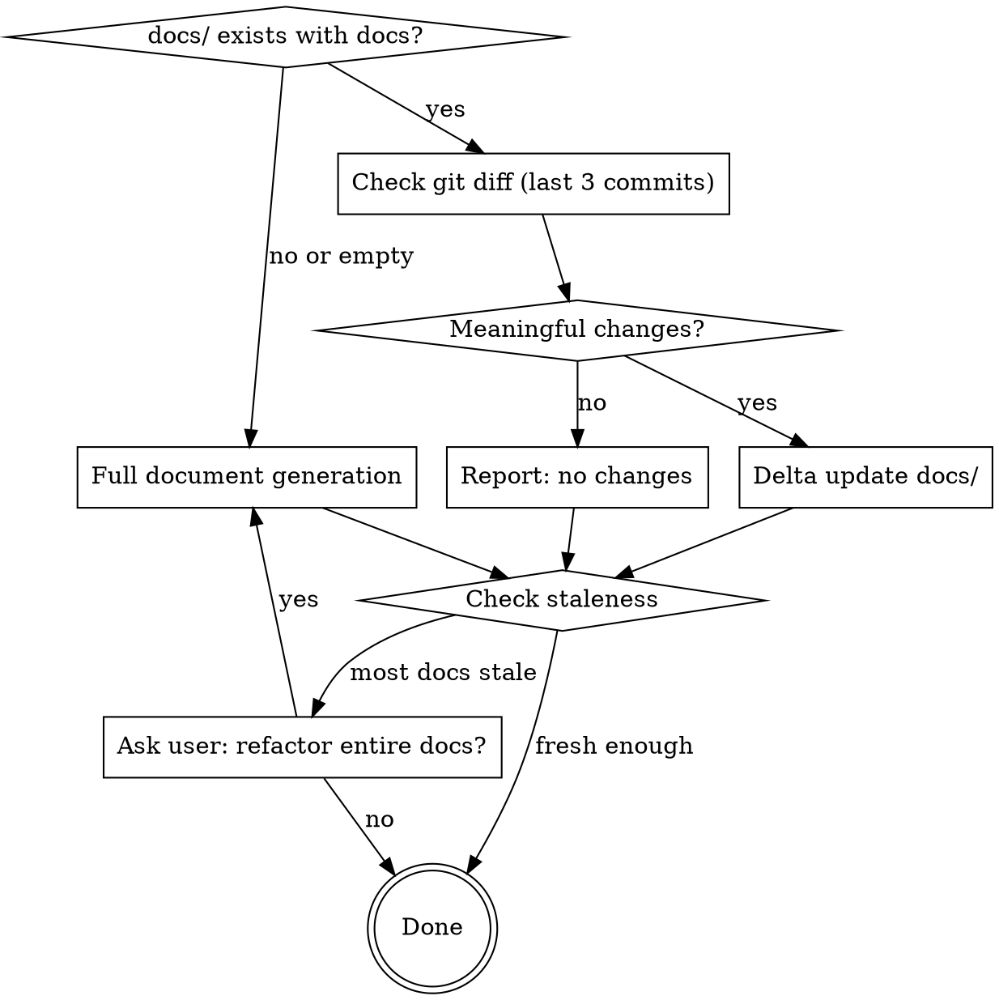

# Document

Generate or incrementally update project documents from the codebase into `docs/`.

## Decision Flow



## Hard Rules (non-negotiable)

1. **AI-reimplementable fidelity.** Every doc must be detailed enough that another AI agent, given *only* the docs folder, can re-implement the entire project from scratch without reading the original source code.

2. **Output directory is `docs`.** All generated documents live under `docs/`.

3. **Chinese-only (简体中文).** All document filenames, directory names, and document content must use Simplified Chinese. No English names for files or folders.

4. **Numbered folder and file convention.** Every directory and file under `docs/` (except the root `README.md`) must follow the `{序号}_{中文名称}` format. Use zero-padded two-digit numbers (`01`, `02`, …). This applies to all levels: top-level category folders, sub-folders, and individual `.md` files.

5. **Delta-only when possible.** If `docs/` already contains detailed documentation, do NOT regenerate from scratch. Use git diff to detect changes and update only affected documents.

6. **Preserve manual edits.** When updating an existing doc file, preserve manually written sections. Only update content that corresponds to changed source code.

7. **No source code in docs.** Never include raw source code (no code blocks with implementation). Use mermaid diagrams for logic flow, and natural language for module/function descriptions. The doc describes *what* and *why*, never the literal *how* of the code.

8. **Modification history on every doc.** Every document under `docs/` must begin with a modification history table (see Modification History format below).

## Prerequisites

This skill depends on the **everything-claude-code** plugin:

```
/plugin marketplace add https://github.com/affaan-m/everything-claude-code
/plugin install everything-claude-code@everything-claude-code
```

## Modification History Format

Every document file under `docs/` must include a modification history table at the very beginning (after any YAML frontmatter, before the main heading). Use this exact format:

```markdown
## Modification History

| Time | Version | Description | Operator |
|------|---------|-------------|----------|
| 2026-05-20 10:30 | v1.0.0 | Initial documentation generated | ATreep |
| 2026-05-21 14:15 | v1.1.0 | Added error handling flow to data-pipeline module | ATreep |
```

Rules for the history table:
- **Time**: ISO date + time of the modification (`YYYY-MM-DD HH:MM`).
- **Version**: Semantic version (`MAJOR.MINOR.PATCH`). MAJOR for doc rewrites, MINOR for new sections/modules, PATCH for fixes and clarifications.
- **Description**: Brief one-line summary of what changed.
- **Operator**: Git username of the person who made the change. Obtain via `git config user.name` or `git log -1 --format='%an'`. If no git username is available, use the system username.
- On every delta update, append a new row to the table. Never remove or modify existing rows.

## Docs Directory Structure

The docs directory uses a numbered Chinese folder hierarchy, organized by domain category at the top level and by module at the detail level:

```
docs/
├── README.md                                       # 导航索引（不含序号前缀）
├── 01_产品需求文档/
│   └── 01_产品需求文档.md                            # PRD：系统概述、能力清单、用户故事、非功能需求
├── 02_核心业务流程/
│   └── 01_核心业务流程.md                            # 端到端业务流程与数据/控制流
├── 03_系统架构与开发/
│   ├── 01_系统架构概述.md                            # 系统结构、边界、技术栈、模块间交互
│   ├── 02_数据模型.md                                # 存储模式、实体、关系（mermaid ER 图）
│   └── 03_模块集成.md                                # 第三方 API/服务及交互契约
├── 04_运行时与部署/
│   ├── 01_运行时环境.md                              # 环境配置、启动脚本、执行模型
│   └── 02_部署与运维.md                              # 部署/运行手册、健康检查、故障/回滚路径
├── 05_实现指南/
│   ├── 01_端到端重建蓝图.md                           # 从零重建的完整实现指南
│   └── 02_模块目录.md                                # 模块目录及覆盖率矩阵
└── 06_模块详细设计/
    ├── 01_认证模块/                                   # 示例：认证模块
    │   ├── 01_模块概述.md                             # 模块职责、设计目标、已知缺陷
    │   ├── 02_登录流程.md                             # 登录子模块 doc
    │   ├── 03_令牌管理.md                             # 令牌子模块 doc
    │   └── 04_会话处理.md                             # 会话子模块 doc
    ├── 02_数据管道/
    │   ├── 01_模块概述.md
    │   ├── 02_数据摄取.md
    │   ├── 03_数据转换.md
    │   └── 04_数据导出.md
    └── 03_用户界面/
        ├── 01_模块概述.md
        ├── 02_仪表盘.md
        └── 03_设置.md
```

### Folder and File Naming Rules

- **Top-level category folders**: `{序号}_{中文类别名}/` directly under `docs/`. Sequence determines the reading order. Categories should cover: product requirements, business flows, architecture, runtime/deployment, implementation guide, and module details.
- **Module folders**: `{序号}_{中文模块名}/` under `06_模块详细设计/`. Module name derived from domain responsibility (e.g., `01_认证模块`, `02_数据管道`).
- **Individual doc files**: `{序号}_{中文文件名}.md` inside their respective folders. Sequence by logical reading order.
- The root `README.md` is the only file without a numeric prefix — it serves as the navigation index.
- Each module folder MUST contain a `01_模块概述.md` (module overview, design objectives, known flaws).
- Sub-modules become additional numbered `.md` files in the same module folder.
- If a sub-module is complex enough, it can become a sub-folder (nested hierarchy uses the same `{序号}_{中文名}` convention).
- **No English names** for any file or directory under `docs/`.

## Core Rules

- Prefer multiple focused files over a single large file.
- Cover **all code modules** in scope: `.py`, `.html`, `.js`, `.ts`, `.tsx`, `.jsx`, `.java`, `.sh`, `.go`, `.rs`, `.php`, `.rb`, `.cs`, `.kt`, `.swift`, `.sql`, `.yaml`, `.yml`.
- Documentation must be detailed enough that Claude Code can implement the full project from docs alone.
- Derive docs from source-of-truth files and code; avoid inventing behavior.
- Use `everything-claude-code:plan` to draft a plan before your actions.
- **No source code** — represent logic with mermaid diagrams (flowchart, sequence, class, state, ER) and describe behavior in natural language. Pseudocode is acceptable only for complex algorithms where natural language alone is ambiguous.

## Mode 1: Full Document Generation (no existing docs/)

Run when `docs/` does not exist or is empty.

### Workflow

1. **Inventory the codebase**
   - Identify project type(s), runtimes, entry points, module boundaries, and infra files.
   - Build a complete module index for all relevant source files in scope.
   - Map modules to a numbered sub-folder hierarchy under `docs/06_模块详细设计/`.

2. **Map architecture and behavior**
   - Trace request/data/control flow across layers.
   - Capture dependencies, external services, config/env requirements, scripts/commands, and operational behavior.
   - Represent all flows as mermaid diagrams.

3. **Generate `docs/` set**
   - `docs/README.md` — 导航索引
   - `docs/01_产品需求文档/01_产品需求文档.md` — 产品需求文档（详见下方 PRD 要求）
   - `docs/02_核心业务流程/01_核心业务流程.md` — 端到端业务流程与数据/控制流（mermaid 图）
   - `docs/03_系统架构与开发/01_系统架构概述.md` — 系统结构、边界、技术栈、模块间交互（mermaid 图）
   - `docs/03_系统架构与开发/02_数据模型.md` — 存储模式、实体、关系（mermaid ER 图）
   - `docs/03_系统架构与开发/03_模块集成.md` — 第三方 API/服务及交互契约
   - `docs/04_运行时与部署/01_运行时环境.md` — 环境配置、启动脚本、执行模型
   - `docs/04_运行时与部署/02_部署与运维.md` — 部署/运行手册、健康检查、故障/回滚路径
   - `docs/05_实现指南/01_端到端重建蓝图.md` — 从零重建的完整实现指南
   - `docs/05_实现指南/02_模块目录.md` — 模块目录及覆盖率矩阵
   - `docs/06_模块详细设计/` — 模块详细设计根目录
   - `docs/06_模块详细设计/{序号}_{模块名}/01_模块概述.md` — 每个模块的概述
   - `docs/06_模块详细设计/{序号}_{模块名}/{序号}_{子模块名}.md` — 每个子模块或功能一个文件

4. **PRD Requirements**

   The `docs/01_产品需求文档/01_产品需求文档.md` must contain:

   - **System Overview**: What the system does, who uses it, and why it exists.
   - **Capabilities**: High-level list of everything the system can do, organized by module.
   - **Module Design Objectives**: For each module in `docs/06_模块详细设计/`, document:
     - What problem it solves.
     - What it was designed to achieve.
     - Known design flaws, limitations, or trade-offs.
   - **User Stories / Use Cases**: Key scenarios the system supports.
   - **Non-Functional Requirements**: Performance, security, scalability constraints.
   - **Out of Scope**: Explicitly list what the system does NOT do.

5. **Per-module documentation requirements**

   Each module sub-folder (`docs/06_模块详细设计/{序号}_{模块名}/`) must include:

   - `01_模块概述.md` with:
     - Module responsibility and scope.
     - Design objectives and known flaws.
     - Dependencies on other modules.
     - Modification history table.
   - One `.md` per sub-module or feature (e.g., `02_登录流程.md`, `03_令牌管理.md`), each containing:
     - File path(s) and responsibility.
     - Public interfaces (functions/classes/endpoints/CLI commands) — described in natural language, not code.
     - Inputs/outputs, side effects, and invariants.
     - Internal dependencies and call relationships (mermaid sequence/flowchart diagrams).
     - Error handling and edge cases.
     - Security considerations and validation boundaries.
     - Reimplementation notes (what must be preserved for parity).
     - Modification history table.

6. **Logic Representation (mermaid)**

   Use mermaid diagrams to represent all logic. Required diagram types:

   | Logic Type | Mermaid Diagram |
   |------------|----------------|
   | Request/data flow | `flowchart TD` or `flowchart LR` |
   | Component interactions | `sequenceDiagram` |
   | Data entities & relationships | `erDiagram` |
   | State machines | `stateDiagram-v2` |
   | Class/module structure | `classDiagram` |
   | System boundaries | `flowchart` with subgraphs |

   Every module overview must include at least one flowchart showing the module's internal flow.

7. **Coverage validation**
   - Produce a coverage matrix in `docs/05_实现指南/02_模块目录.md` mapping every discovered source module to a documentation target folder.
   - Explicitly list any skipped/generated/vendor files and the reason.
   - If coverage is incomplete, continue until all in-scope modules are documented.

8. **Staleness and provenance**
   - Add generated markers and scan metadata (date, scope, files scanned).
   - Preserve manually written sections when updating existing docs.

9. **Final summary**
   - Report created/updated files in `docs`.
   - Report module coverage totals and any intentional exclusions.

## Mode 2: Delta Update (docs/ already exists)

Run when `docs/` exists with detailed documentation.

### Workflow

1. **Detect Changes (git diff, last 3 commits)**

   ```bash
   git diff HEAD~3..HEAD --name-status
   ```

   - Focus on source files only. Ignore non-source files (`.md`, `.gitignore`, lock files, config files that don't affect behavior).
   - If there are also uncommitted changes, include them: `git diff HEAD --name-status`.
   - Default depth is 3 commits. User can override by passing a different range.

   If no meaningful source changes are found, report this and stop.

2. **Map Changes to Doc Files**

   For each changed source file:
   - Look up the corresponding module folder in `docs/06_模块详细设计/{序号}_{模块名}/`.
   - Check whether the change affects other doc files (e.g., `03_系统架构与开发/`, `04_运行时与部署/`, `01_产品需求文档/`).
   - If a changed module has no corresponding docs folder yet, flag it as **new** — create the folder and `01_模块概述.md`.
   - If a docs folder exists but the source module was deleted, flag it for removal or archival.

3. **Read and Analyze Affected Docs**

   For each doc file that needs updating:
   - Read the current doc content.
   - Read the corresponding source code (current state).
   - Identify what has changed and which sections of the doc are now stale.

4. **Update Docs (delta only)**

   Apply targeted updates:
   - **Modified modules** — update relevant sections in the module's doc files under `06_模块详细设计/`.
   - **New modules** — create `docs/06_模块详细设计/{序号}_{模块名}/01_模块概述.md` and sub-module docs following per-module documentation requirements.
   - **Deleted modules** — mark archived or remove if appropriate.
   - **Cross-cutting changes** — update affected files in `01_产品需求文档/`, `02_核心业务流程/`, `03_系统架构与开发/`, `04_运行时与部署/`.
   - **Coverage matrix** — update `docs/05_实现指南/02_模块目录.md` if modules were added or removed.
   - **PRD** — update design objectives/flaws in `docs/01_产品需求文档/01_产品需求文档.md` if module behavior changed.
   - **Index** — update `docs/README.md` if new doc files/folders were added or removed.
   - **Modification history** — append a new row to the history table in every affected document. Use git username from `git config user.name`.

5. **Final Summary**

   Report:
   - Source files detected as changed.
   - Doc files/folders updated/created/archived.
   - Modules skipped (non-source, vendor, generated) and why.
   - If no docs needed updating, say so explicitly.

## Staleness Check (both modes)

After completing either mode, compare doc freshness against the project:

1. Get the newest modification time among doc files: `find docs -name '*.md' -exec stat -f '%m' {} \; | sort -rn | head -1`
2. Get the newest modification time among source files (exclude `docs/`, `node_modules/`, `.git/`): `find . -name '*.ts' -o -name '*.py' -o -name '*.go' ... | xargs stat -f '%m' | sort -rn | head -1`
3. If most docs are significantly older than the newest source files (e.g., >7 days gap), ask the user:

   > Most docs haven't been updated in a while compared to recent source changes. Would you like me to refactor the entire docs from scratch?

   - If yes → switch to Mode 1 (full document generation).
   - If no → stop.

## Output Quality Bar

The documentation must provide enough architectural, interface, and behavioral detail for full-project reconstruction without reading the original code — whether generated fresh or updated incrementally. Logic must be expressed through mermaid diagrams and natural language descriptions, never raw source code.
