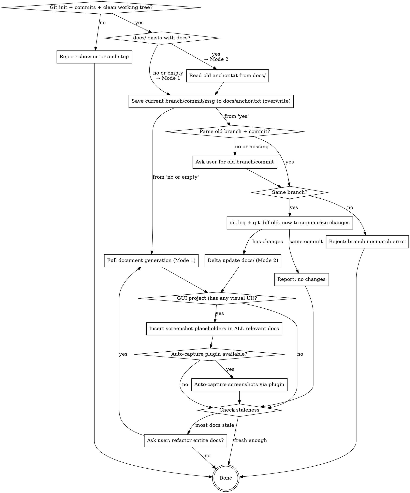

# Document

Generate or incrementally update project documents from the codebase into `docs/`.

## Mode Selection Rule (CRITICAL)

**Mode is determined by whether `docs/` exists with documentation, NOT by whether `anchor.txt` exists.**

- `docs/` does NOT exist or is empty → **Mode 1** (full generation)
- `docs/` exists with documentation files → **Mode 2** (delta update), **ALWAYS**. This is non-negotiable regardless of `anchor.txt` presence.

## Decision Flow



## Hard Rules (non-negotiable)

1. **AI-reimplementable fidelity.** Every doc must be detailed enough that another AI agent, given *only* the docs folder, can re-implement the entire project from scratch without reading the original source code.

2. **Output directory is `docs`.** All generated documents live under `docs/`.

3. **Chinese-only (简体中文).** All document filenames, directory names, and document content must use Simplified Chinese. No English names for files or folders.

4. **Numbered folder and file convention.** Every directory and file under `docs/` (except the root `README.md`) must follow the `{序号}_{中文名称}` format. Use zero-padded two-digit numbers (`01`, `02`, …). This applies to all levels: top-level category folders, sub-folders, and individual `.md` files.

5. **Delta-only when possible.** If `docs/` already contains documentation (regardless of whether `anchor.txt` exists), you MUST use Mode 2 (delta update). Do NOT regenerate from scratch. Use git diff to detect changes and update only affected documents. The presence of existing docs is the ONLY factor for mode selection — `anchor.txt` absence does NOT justify switching to Mode 1.

6. **Preserve manual edits.** When updating an existing doc file, preserve manually written sections. Only update content that corresponds to changed source code.

7. **No source code in docs.** Never include raw source code (no code blocks with implementation). Use mermaid diagrams for logic flow, and natural language for module/function descriptions. The doc describes *what* and *why*, never the literal *how* of the code.

7a. **Architecture and layout diagrams must use mermaid.** When representing system architecture, component layout, page structure, UI layout design, or any structural diagram, ALWAYS use mermaid diagrams (flowchart, graph, block diagram). NEVER use ASCII character drawings (`┌─┐└─┘│├┤`), plain-text boxes, or manual text-based layout diagrams. Mermaid ensures the diagrams are clean, maintainable, and consistently render across different viewers.

7a-i. **Convert old ASCII flowcharts during delta updates.** When updating existing docs (Mode 2), scan ALL old doc files for ASCII character drawings (`┌─┐└─┘│├┤`), manual text-based layout diagrams, plain-text boxes, and any non-mermaid diagram markup. Convert every found ASCII diagram to its mermaid equivalent (flowchart, sequenceDiagram, erDiagram, etc.). This takes priority over rule 6 (preserve manual edits) — ASCII diagrams are a formatting anti-pattern, not meaningful manual content. Check for common ASCII drawing patterns: box-drawing characters (`┌─┐└─┘│├┤┬┴┼`), plus/minus/pipe box borders (`+--+`, `|`), arrow lines (`---->`, `==>`), and indented text inside hand-drawn boxes.

7b. **Mermaid node names with spaces MUST use quotes; inner quotes MUST be escaped.** When a mermaid node identifier contains spaces or special characters (e.g., Chinese characters, colons, parentheses), wrap the description text in double quotes inside square brackets. When the node text itself contains double-quote characters (e.g., Chinese quotation marks `""` around a term), those inner quotes MUST be HTML-escaped as `&quot;` within the outer quotes. Failing to quote names or escape inner quotes causes mermaid rendering errors.

```
✅ CORRECT:
    AuthCtx["AuthContext Provider"]
    Login["用户登录流程"]
    DB["Database (PostgreSQL)"]
    ModuleA["01_认证模块"]
    ExportBtn["点击&quot;导出Word&quot;按钮"]

❌ WRONG (will fail to render):
    AuthCtx[AuthContext Provider]
    Login[用户登录流程]
    DB[Database (PostgreSQL)]
    ExportBtn["点击"导出Word"按钮"]
```

This applies to ALL mermaid node shapes: `[]` (rectangle), `()` (rounded), `{}` (diamond), `[()]` (circle), `[//]` (parallelogram), etc. The quoting and escaping rules are the same for all shapes.

7c. **Subgraph headers must NOT use node shapes; define nodes with shapes inside the subgraph.** When using `subgraph` to group components, the subgraph header should only specify the ID and optional label using `subgraph ID [Label Text]` format. NEVER put node shape syntax (e.g., `[()]`, `[( )]`, `{ }`) directly in the subgraph header line. Instead, define the shaped node as a separate node inside the subgraph body, and connect related nodes with edges (`-->`).

```
✅ CORRECT:
    subgraph DB_Layer [Database Layer]
        DB[(PostgreSQL)]
        DB --> Table["journal_information表"]
    end

    subgraph Auth_Zone [Authentication]
        AuthSvc[Auth Service]
        AuthSvc --> TokenMgr["Token Manager"]
    end

❌ WRONG (shape in subgraph header — will render incorrectly):
    subgraph DB[(PostgreSQL)]
        Table["journal_information表"]
    end

    subgraph AuthSvc[Auth Service]
        TokenMgr["Token Manager"]
    end
```

This applies to ALL subgraph shapes: `subgraph ID[Label]` (rectangle), `subgraph ID(Label)` (rounded), `subgraph ID[(Label)]` (cylinder/database), `subgraph ID{Label}` (diamond), etc. Always use the clean `subgraph ID [Label]` header format and define shaped nodes inside.

8. **Modification history on every doc.** Every document under `docs/` must begin with a modification history table (see Modification History format below).

9. **Screenshot placeholders for GUI applications.** For ANY project with a graphical user interface (web frontend, desktop app, mobile app, or any visual UI):

   **CRITICAL — Architecture docs ARE NOT "pure technologic documents" in GUI projects.** System architecture overviews, business flow docs, runtime environment docs, and module detail docs ALL describe a visual system. Screenshots are essential for understanding UI architecture, component layout, visual design patterns, and user interaction flows. Do NOT skip screenshots in architecture docs for GUI apps with the rationalization that "arch docs are pure technologic documents" — this is categorically wrong. GUI architecture IS visual architecture.

   - Insert screenshot placeholders at key UI interaction points in ALL relevant docs where visual UI is described — including `03_系统架构与开发/` (system architecture overviews showing UI structure), `02_核心业务流程/` (business flows with UI steps), `04_运行时与部署/` (runtime screenshots of the running app), and ALL of `06_模块详细设计/` (module detail pages and components).
   - Each placeholder MUST be followed by a markdown image link pointing to the `截图/` directory at the same directory level.
   - If the project is a Web App, auto-capture screenshots using the `auto-capture-for-webapp:take-screenshots` skill after generating docs. If the project is a non-web GUI app (desktop, mobile), still insert placeholders — invoke an auto-screenshot plugin if available, otherwise leave placeholders for manual capture. Placeholders serve as the capture specification regardless of capture method.

## Prerequisites

This skill depends on the **everything-claude-code** plugin:

```
/plugin marketplace add https://github.com/affaan-m/everything-claude-code
/plugin install everything-claude-code@everything-claude-code
```

## Modification History Format

Every document file under `docs/` must include a modification history table at the very beginning (after any YAML frontmatter, before the main heading). Use this exact format:

```markdown
## Modification History

| Time | Version | Description | Operator |
|------|---------|-------------|----------|
| 2026-05-20 10:30 | v1.0.0 | Initial documentation generated | ATreep |
| 2026-05-21 14:15 | v1.1.0 | Added error handling flow to data-pipeline module | ATreep |
```

Rules for the history table:
- **Time**: ISO date + time of the modification (`YYYY-MM-DD HH:MM`).
- **Version**: Semantic version (`MAJOR.MINOR.PATCH`). MAJOR for doc rewrites, MINOR for new sections/modules, PATCH for fixes and clarifications.
- **Description**: Brief one-line summary of what changed.
- **Operator**: Git username of the person who made the change. Obtain via `git config user.name` or `git log -1 --format='%an'`. If no git username is available, use the system username.
- On every delta update, append a new row to the table. Never remove or modify existing rows.

## Docs Directory Structure

The docs directory uses a numbered Chinese folder hierarchy, organized by domain category at the top level and by module at the detail level:

```
docs/
├── README.md                                       # 导航索引（不含序号前缀）
├── anchor.txt                                      # Git 基准版本信息（分支名 + commit hash + commit message）
├── 01_产品需求文档/
│   └── 01_产品需求文档.md                            # PRD：系统概述、能力清单、用户故事、非功能需求
├── 02_核心业务流程/
│   ├── 01_核心业务流程.md                            # 端到端业务流程与数据/控制流
│   └── 截图/                                         # GUI项目：业务流程UI截图
├── 03_系统架构与开发/
│   ├── 01_系统架构概述.md                            # 系统结构、边界、技术栈、模块间交互
│   ├── 02_数据模型.md                                # 存储模式、实体、关系（mermaid ER 图）
│   ├── 03_模块集成.md                                # 第三方 API/服务及交互契约
│   └── 截图/                                         # GUI项目：架构UI截图
├── 04_运行时与部署/
│   ├── 01_运行时环境.md                              # 环境配置、启动脚本、执行模型
│   ├── 02_部署与运维.md                              # 部署/运行手册、健康检查、故障/回滚路径
│   └── 截图/                                         # GUI项目：运行中应用截图
├── 05_实现指南/
│   ├── 01_端到端重建蓝图.md                           # 从零重建的完整实现指南
│   └── 02_模块目录.md                                # 模块目录及覆盖率矩阵
└── 06_模块详细设计/
    ├── 01_认证模块/                                   # 示例：认证模块
    │   ├── 01_模块概述.md                             # 模块职责、设计目标、已知缺陷
    │   ├── 02_登录流程.md                             # 登录子模块 doc
    │   ├── 03_令牌管理.md                             # 令牌子模块 doc
    │   ├── 04_会话处理.md                             # 会话子模块 doc
    │   └── 截图/                                      # 截图目录（与 doc 文件同级）
    │       ├── 1-login-page.png
    │       └── 2-login-error.png
    ├── 02_数据管道/
    │   ├── 01_模块概述.md
    │   ├── 02_数据摄取.md
    │   ├── 03_数据转换.md
    │   └── 04_数据导出.md
    └── 03_用户界面/
        ├── 01_模块概述.md
        ├── 02_仪表盘.md
        ├── 03_设置.md
        └── 截图/                                      # 用户界面模块的截图目录
            ├── 1-dashboard-overview.png
            └── 2-settings-page.png
```

### Folder and File Naming Rules

- **Top-level category folders**: `{序号}_{中文类别名}/` directly under `docs/`. Sequence determines the reading order. Categories should cover: product requirements, business flows, architecture, runtime/deployment, implementation guide, and module details.
- **Module folders**: `{序号}_{中文模块名}/` under `06_模块详细设计/`. Module name derived from domain responsibility (e.g., `01_认证模块`, `02_数据管道`).
- **Individual doc files**: `{序号}_{中文文件名}.md` inside their respective folders. Sequence by logical reading order.
- The root `README.md` is the only file without a numeric prefix — it serves as the navigation index.
- Each module folder MUST contain a `01_模块概述.md` (module overview, design objectives, known flaws).
- Sub-modules become additional numbered `.md` files in the same module folder.
- If a sub-module is complex enough, it can become a sub-folder (nested hierarchy uses the same `{序号}_{中文名}` convention).
- **No English names** for any file or directory under `docs/`.
- **Screenshot directory**: `截图/` placed at the same level as the `.md` files that reference them. For GUI projects, this means `截图/` directories may exist at multiple levels: under `02_核心业务流程/`, `03_系统架构与开发/`, `04_运行时与部署/`, and under each UI module folder in `06_模块详细设计/`. Any doc that references screenshots needs a `截图/` directory at its level.

## Screenshot Placeholders for GUI Applications

### When to Insert Placeholders

Screenshot placeholders are required for **any project with a graphical user interface (GUI)**. This includes:

- Web frontend pages (HTML, React, Vue, Angular, Svelte components)
- Mobile app screens (SwiftUI, Jetpack Compose, Flutter widgets, React Native)
- Desktop app windows (Electron, Qt, WinForms, WPF, Cocoa, SwiftUI)
- CLI/TUI interactive interfaces
- Any module that renders a visual output

**CRITICAL**: For GUI projects, screenshot placeholders are required in ALL doc categories that describe visual UI — not just `06_模块详细设计/`. This includes architecture overviews, business flow docs, and runtime environment docs. The rationalization "arch docs are pure technologic documents, should not have screenshot placeholders" is WRONG for GUI projects.

For GUI projects, insert screenshot placeholders in these doc categories when they discuss visual UI:
- `01_产品需求文档/01_产品需求文档.md` — screenshots of main UI pages illustrating capabilities
- `02_核心业务流程/01_核心业务流程.md` — screenshots at each major UI step in the flow
- `03_系统架构与开发/01_系统架构概述.md` — screenshots of UI layout, component hierarchy, page structure
- `03_系统架构与开发/03_模块集成.md` — screenshots of integration points visible in the UI
- `04_运行时与部署/01_运行时环境.md` — screenshots of the running application
- `06_模块详细设计/` — screenshots for EVERY UI page/component/view in all states

Placeholders are NOT needed for:
- Pure backend API modules (no visual interface)
- Data processing pipelines (no UI)
- Library/utility modules (no UI)
- Pure infrastructure/CI-CD modules (no UI, no visual output)

**CRITICAL — GUI projects exception (anti-rationalization):** For GUI applications, architecture overview docs (`03_系统架构与开发/`), business flow docs (`02_核心业务流程/`), and runtime docs (`04_运行时与部署/`) ARE NOT "infrastructure/config documents." They describe a visual system and MUST include screenshot placeholders wherever they discuss UI layout, page structure, navigation flows, or visual component hierarchies. The rationalization "arch docs are pure technologic documents, should not have screenshot placeholders" is WRONG for GUI projects. For GUI apps, architecture IS visual — screenshots in arch docs are mandatory, not optional.

### Placeholder Format

Use this exact format — each placeholder MUST be followed by a markdown image link pointing to the `截图/` directory:

```
【图X：[所属功能模块] - [页面/组件名称] - [当前界面状态]，[简要描述页面整体布局，约30字]】


```

**The description should be brief** — describe the overall page layout and module context at a high level. Do NOT enumerate individual UI widgets, color HEX codes, button labels, or pixel-level details. A reader should understand which page this is and its general structure, not reconstruct every pixel.

The description must answer:
1. **Which feature module** does this page belong to? (e.g., "听课记录模块", "用户设置")
2. **What page/component** is this? (e.g., "编辑页面", "登录弹窗")
3. **What state** is the interface in? (e.g., "默认状态", "空数据列表")
4. **What is the overall layout?** (e.g., "顶部导航+左侧菜单+主内容区三栏布局")

The image filename uses the pattern `X-descriptive-name.png` where:
- `X` is the sequential figure number (starting from 1, numbering within each `.md` file)
- `descriptive-name` is a short English slug describing the screenshot

Brief examples:

- `【图1：用户认证模块 - 登录页面 - 默认状态，页面居中展示Logo与登录表单，包含用户名、密码输入框及登录按钮】` followed by ``

- `【图2：用户管理模块 - 设置页面 - 编辑状态，顶部标题栏+主体卡片式表单布局，包含头像、昵称、邮箱等设置项】` followed by ``

- `【图3：问卷管理模块 - 列表页面 - 三条数据，顶部标题栏与筛选区+下方卡片列表布局，每张卡片展示标题、时间与状态】` followed by ``

### Screenshot Count Guidelines

Screenshot counts (per doc file or module, adjust up for large GUI projects):

| UI Scope | Base Screenshot Count |
|----------|-----------------|
| Small (1-3 pages/views) | 3-6 screenshots |
| Medium (4-10 pages/views) | 6-15 screenshots |
| Large (11+ pages/views) | 15-25 screenshots |

**For GUI projects, screenshots apply to ALL doc types that discuss visual UI,** not just `06_模块详细设计/`:

| Doc Category | Screenshot Requirements for GUI Projects |
|--------------|------------------------------------------|
| `01_产品需求文档/` | Screenshots of main UI pages illustrating core capabilities |
| `02_核心业务流程/` | Screenshots at each major UI step in the business flow |
| `03_系统架构与开发/01_系统架构概述.md` | Screenshots showing overall UI layout, component hierarchy, page structure |
| `03_系统架构与开发/02_数据模型.md` | Usually no screenshots (data models are non-visual) |
| `03_系统架构与开发/03_模块集成.md` | Screenshots of integration points visible in the UI |
| `04_运行时与部署/01_运行时环境.md` | Screenshots of the running application, startup screens |
| `06_模块详细设计/` | Screenshots for every UI page/component/view (all states) |

Priority for screenshots in GUI project docs:
1. Main page / entry view (logged-in and logged-out states)
2. Core feature pages (main interaction views)
3. Key interaction states (form validation, loading, empty, error states)
4. Complex dialogs or modals
5. Data visualization or result views
6. Navigation structure (menu, breadcrumb, tab switching)
7. Settings/configuration pages
8. Architecture overview diagrams (UI component layout, page hierarchy, navigation map)

### Auto-Capture with Screenshot Plugins

When the project is a **GUI application**, attempt to auto-capture screenshots for each placeholder using an available screenshot plugin.

**For Web Apps** (detected by presence of `.html`, `.tsx`, `.jsx`, `.vue`, `.svelte` files, or a `package.json` with frontend framework dependencies), use the `auto-capture-for-webapp:take-screenshots` skill.

**REQUIRED SKILL:** Use `auto-capture-for-webapp:take-screenshots` for web app screenshot automation. This skill handles:
- Starting the dev server and waiting for readiness
- Navigating to each page/route
- Capturing screenshots for each placeholder
- Saving screenshots to the correct `截图/` directories
- Graceful error handling and cleanup

**For non-web GUI apps** (desktop, mobile), invoke an auto-screenshot plugin if available. The placeholder format is the same regardless of capture method.

If no auto-capture skill is available, or the project cannot be started, skip auto-capture and leave the placeholders for manual capture. The placeholders serve as the capture specification.

## Core Rules

- Prefer multiple focused files over a single large file.
- Cover **all code modules** in scope: `.py`, `.html`, `.js`, `.ts`, `.tsx`, `.jsx`, `.java`, `.sh`, `.go`, `.rs`, `.php`, `.rb`, `.cs`, `.kt`, `.swift`, `.sql`, `.yaml`, `.yml`.
- Documentation must be detailed enough that Claude Code can implement the full project from docs alone.
- Derive docs from source-of-truth files and code; avoid inventing behavior.
- Use `everything-claude-code:plan` to draft a plan before your actions.
- **No source code** — represent logic with mermaid diagrams (flowchart, sequence, class, state, ER) and describe behavior in natural language. Pseudocode is acceptable only for complex algorithms where natural language alone is ambiguous.

## Pre-generation Git Validation (both modes)

Before any document generation or update, verify the codebase is in a valid state.

### Validation Steps

Execute these checks in order. If ANY check fails, reject and stop immediately.

1. **Check git initialization**: `git rev-parse --git-dir`
   - If the command fails → **Reject**: "项目未初始化 Git，请先执行 `git init` 并提交代码后再生成文档。"

2. **Check commit history**: `git rev-list --count HEAD`
   - If the count is 0 or the command fails → **Reject**: "项目尚无任何 commit 记录，请先提交代码后再生成文档。"

3. **Check working tree is clean**: `git diff HEAD --stat`
   - If there are ANY differences (uncommitted changes) → **Reject**: "当前工作区存在未提交的变更，请先提交所有变更后再生成文档。未提交的文件：[列出差异文件列表]"

All three checks must pass before proceeding to Mode 1 or Mode 2.

## Anchor File

After git validation passes, manage the `docs/anchor.txt` file to track which commit the documentation is based on.

### Save Anchor (both modes)

After validation passes, collect current git state and write to `docs/anchor.txt`:

```bash
BRANCH=$(git branch --show-current)
COMMIT=$(git rev-parse HEAD)
MESSAGE=$(git log -1 --format=%s)
```

Write to `docs/anchor.txt` with the following format:

```
branch: <branch-name>
commit: <full-commit-hash>
message: <commit-message>
```

**CRITICAL**: Always use **overwrite** mode when writing `docs/anchor.txt`. If the file already exists, replace its entire content. Never append.

**For Mode 1 (new docs/)**: Create the `docs/` directory first (if it doesn't exist), then write `anchor.txt`.

### Read Old Anchor (Mode 2 only)

For Mode 2 (delta update), BEFORE overwriting `docs/anchor.txt`, read the existing `docs/anchor.txt` to obtain the old document baseline:

- Parse the `branch:` line → old branch name
- Parse the `commit:` line → old commit hash (full SHA)

If `anchor.txt` does NOT exist, or either value is missing / cannot be parsed:

1. **Do NOT fall back to Mode 1.** Existing docs always mean Mode 2.
2. **Ask the user** for the old baseline information:

   > 无法从 docs/anchor.txt 解析旧的文档基准版本信息，请提供旧文档是基于哪个分支、哪个 commit 生成的？

   The user must provide BOTH:
   - Old branch name (e.g., `main`, `develop`)
   - Old commit hash (full SHA recommended, short hash acceptable)

3. **Do NOT proceed** with delta update until the user provides valid branch and commit information.
4. **After user provides the info**, proceed with branch comparison and delta update as normal.
5. **The new `anchor.txt` is always created** — after reading the old anchor (or after the user provides the missing info), save the current HEAD info to `docs/anchor.txt` (overwrite mode, see Save Anchor above). This ensures `anchor.txt` exists for ALL future delta updates.

**CRITICAL**: The absence of `anchor.txt` is expected when docs were created by a previous version of this skill or migrated from elsewhere. It means the old baseline must be obtained from the user — it does NOT mean the docs are invalid or should be regenerated.

### Branch Comparison (Mode 2 only)

Compare old branch (from old anchor.txt) with current branch (from `git branch --show-current`):

- **Same branch** → Proceed with delta update. Use `git log <old-commit>..<new-commit> --oneline` to get the commit history, and `git diff <old-commit>..<new-commit> --name-status` to get file changes.
- **Different branch** → **Reject and stop**: "旧文档基于分支 `<old-branch>`（commit `<old-commit-short>`）生成，当前分支为 `<current-branch>`，分支不一致，无法进行增量更新。请切换到 `<old-branch>` 分支后再更新文档，或使用 Mode 1 从当前分支重新生成全部文档。"

## Mode 1: Full Document Generation (docs/ does NOT exist or is empty)

Run ONLY when `docs/` does not exist or is empty. If `docs/` exists with any documentation files (even without `anchor.txt`), you MUST use Mode 2.

### Workflow

0. **Validate git state and save anchor**
   - Run the Pre-generation Git Validation checks (see above). If any check fails, reject and stop.
   - Create the `docs/` directory if it doesn't exist.
   - Save the current branch name, commit hash, and commit message to `docs/anchor.txt` (overwrite mode, see Anchor File section above).

1. **Inventory the codebase**
   - Identify project type(s), runtimes, entry points, module boundaries, and infra files.
   - Build a complete module index for all relevant source files in scope.
   - Map modules to a numbered sub-folder hierarchy under `docs/06_模块详细设计/`.
   - **Detect GUI projects**: Identify whether the project has ANY graphical user interface — web frontend (HTML, React, Vue, Angular, Svelte), desktop GUI (Electron, Qt, WinForms, WPF, SwiftUI, Cocoa), or mobile UI (Flutter, React Native, Jetpack Compose, SwiftUI). If ANY GUI code exists, this is a GUI project and ALL screenshot rules apply to ALL doc categories (not just `06_模块详细设计/`).

2. **Map architecture and behavior**
   - Trace request/data/control flow across layers.
   - Capture dependencies, external services, config/env requirements, scripts/commands, and operational behavior.
   - Represent all flows as mermaid diagrams.
   - For frontend/UI modules, additionally map the visual layout: pages, components, their states, and user interaction flows.

3. **Generate `docs/` set**
   - `docs/README.md` — 导航索引
   - `docs/01_产品需求文档/01_产品需求文档.md` — 产品需求文档（详见下方 PRD 要求）
   - `docs/02_核心业务流程/01_核心业务流程.md` — 端到端业务流程与数据/控制流（mermaid 图）
   - `docs/03_系统架构与开发/01_系统架构概述.md` — 系统结构、边界、技术栈、模块间交互（mermaid 图）
   - `docs/03_系统架构与开发/02_数据模型.md` — 存储模式、实体、关系（mermaid ER 图）
   - `docs/03_系统架构与开发/03_模块集成.md` — 第三方 API/服务及交互契约
   - `docs/04_运行时与部署/01_运行时环境.md` — 环境配置、启动脚本、执行模型
   - `docs/04_运行时与部署/02_部署与运维.md` — 部署/运行手册、健康检查、故障/回滚路径
   - `docs/05_实现指南/01_端到端重建蓝图.md` — 从零重建的完整实现指南
   - `docs/05_实现指南/02_模块目录.md` — 模块目录及覆盖率矩阵
   - `docs/06_模块详细设计/` — 模块详细设计根目录
   - `docs/06_模块详细设计/{序号}_{模块名}/01_模块概述.md` — 每个模块的概述
   - `docs/06_模块详细设计/{序号}_{模块名}/{序号}_{子模块名}.md` — 每个子模块或功能一个文件

4. **Insert Screenshot Placeholders (GUI projects only)**
   - **For GUI projects**, insert screenshot placeholders at key UI interaction points in ALL relevant doc files (see Screenshot Placeholder Format).
   - This includes: `01_产品需求文档/`, `02_核心业务流程/`, `03_系统架构与开发/01_系统架构概述.md`, `03_系统架构与开发/03_模块集成.md`, `04_运行时与部署/01_运行时环境.md`, and ALL of `06_模块详细设计/`.
   - Place placeholders after the natural language description of each page/view/component, before the next section.
   - Create the `截图/` subdirectory in each module folder (under `06_模块详细设计/`) that has frontend UI content. For screenshots referenced from top-level docs (`02_核心业务流程/`, `03_系统架构与开发/`, etc.), create the `截图/` directory at the same level as the referencing doc.
   - **Do NOT skip arch docs** with the excuse that they are "pure technologic documents." For GUI apps, architecture IS visual — architecture docs MUST have screenshot placeholders.
   - **For non-GUI projects** (pure backend, CLI-only, library), skip screenshot placeholders entirely.

5. **Auto-Capture Screenshots (GUI projects with auto-capture capability)**
   - If the project is a **Web App**, use the `auto-capture-for-webapp:take-screenshots` skill to capture real screenshots for each placeholder.
   - If the project is a **non-web GUI app** (desktop, mobile) and an auto-screenshot plugin is available, invoke it with the project source path and the list of screenshot placeholders.
   - Invoke the auto-capture skill with the project source path and the list of ALL screenshot placeholders to capture (across all doc categories, not just `06_模块详细设计/`).
   - The auto-capture skill handles starting the app, navigating pages, capturing screenshots, and saving them to the correct `截图/` directories.
   - If no auto-capture skill is available or the project cannot be started, skip auto-capture. The placeholders remain in the docs for manual capture later — they serve as the capture specification.

6. **PRD Requirements**

   The `docs/01_产品需求文档/01_产品需求文档.md` must contain:

   - **System Overview**: What the system does, who uses it, and why it exists.
   - **Capabilities**: High-level list of everything the system can do, organized by module.
   - **Module Design Objectives**: For each module in `docs/06_模块详细设计/`, document:
     - What problem it solves.
     - What it was designed to achieve.
     - Known design flaws, limitations, or trade-offs.
   - **User Stories / Use Cases**: Key scenarios the system supports.
   - **Non-Functional Requirements**: Performance, security, scalability constraints.
   - **Out of Scope**: Explicitly list what the system does NOT do.

7. **Per-module documentation requirements**

   Each module sub-folder (`docs/06_模块详细设计/{序号}_{模块名}/`) must include:

   - `01_模块概述.md` with:
     - Module responsibility and scope.
     - Design objectives and known flaws.
     - Dependencies on other modules.
     - Modification history table.
   - One `.md` per sub-module or feature (e.g., `02_登录流程.md`, `03_令牌管理.md`), each containing:
     - File path(s) and responsibility.
     - Public interfaces (functions/classes/endpoints/CLI commands) — described in natural language, not code.
     - Inputs/outputs, side effects, and invariants.
     - Internal dependencies and call relationships (mermaid sequence/flowchart diagrams).
     - Error handling and edge cases.
     - Security considerations and validation boundaries.
     - Reimplementation notes (what must be preserved for parity).
     - Modification history table.
     - **For GUI project sub-modules with visual UI**: Screenshot placeholders at key visual states.

8. **Logic Representation (mermaid)**

   Use mermaid diagrams to represent all logic, architecture, and layout structures. NEVER use ASCII character drawings (`┌─┐└─┘│├┤`) for any diagram — mermaid ensures clean, maintainable, and consistently rendered output.

   Required diagram types:

   | Logic Type | Mermaid Diagram |
   |------------|----------------|
   | Request/data flow | `flowchart TD` or `flowchart LR` |
   | Component interactions | `sequenceDiagram` |
   | Data entities & relationships | `erDiagram` |
   | State machines | `stateDiagram-v2` |
   | Class/module structure | `classDiagram` |
   | System boundaries / architecture | `flowchart` with subgraphs |
   | Page layout design / UI structure | `graph` or `flowchart` with subgraphs |

   Every module overview must include at least one flowchart showing the module's internal flow.

   **Mermaid quoting rules (CRITICAL):** When a node identifier contains spaces, Chinese characters, colons, parentheses, or any special characters, the display text MUST be wrapped in double quotes inside the brackets. When the node text itself contains double-quote characters (e.g., Chinese quotation marks `""` around a term), those inner quotes MUST be HTML-escaped as `&quot;` within the outer quotes. Failing to quote names or escape inner quotes causes mermaid rendering errors:
   ```
   ✅ CORRECT:
       AuthCtx["AuthContext Provider"]
       Login["用户登录流程"]
       DB["Database (PostgreSQL)"]
       ModuleA["01_认证模块"]
       ExportBtn["点击&quot;导出Word&quot;按钮"]

   ❌ WRONG (will cause rendering failure):
       AuthCtx[AuthContext Provider]
       Login[用户登录流程]
       DB[Database (PostgreSQL)]
       ExportBtn["点击"导出Word"按钮"]
   ```
   This rule applies to ALL node shapes: `[]` (rectangle), `()` (rounded corners), `{}` (diamond), `[()]` (circle), `[//]` (parallelogram), etc.

9. **Coverage validation**
   - Produce a coverage matrix in `docs/05_实现指南/02_模块目录.md` mapping every discovered source module to a documentation target folder.
   - Explicitly list any skipped/generated/vendor files and the reason.
   - If coverage is incomplete, continue until all in-scope modules are documented.

10. **Staleness and provenance**
    - Add generated markers and scan metadata (date, scope, files scanned).
    - Preserve manually written sections when updating existing docs.

11. **Final summary**
    - Report created/updated files in `docs`.
    - Report module coverage totals and any intentional exclusions.

## Mode 2: Delta Update (docs/ already exists)

Run when `docs/` exists with detailed documentation.

### Workflow

0. **Validate git state**
   - Run the Pre-generation Git Validation checks (see above). If any check fails, reject and stop.
   - This ensures the codebase is on a clean commit before delta update.

1. **Read Old Anchor and Detect Changes**

   **First, obtain the old baseline** (see Anchor File section above for full details):

   - Read `docs/anchor.txt` if it exists. Parse the `branch:` and `commit:` lines.
   - If `anchor.txt` does NOT exist or cannot be parsed: **ask the user** for the old branch and commit hash. Do NOT fall back to Mode 1. Wait for the user to provide valid information before continuing.
   - If the user cannot provide this information, explain that delta update requires a baseline commit to compute diffs, and offer to use Mode 1 as a last resort only if the user explicitly confirms.

   **After obtaining the old baseline**, save the new anchor (with current HEAD info, overwrite mode). This creates `docs/anchor.txt` if it didn't exist before, ensuring all future updates have an `anchor.txt` baseline.

   Then compute the diff between the old and new commits:

   ```bash
   # Get all commit messages between old and new commit (summarize project change intent)
   git log <old-commit>..<new-commit> --oneline

   # Get all file changes between old and new commit
   git diff <old-commit>..<new-commit> --name-status
   ```

   - Focus on source files only. Ignore non-source files (`.md`, `.gitignore`, lock files, config files that don't affect behavior).
   - Use the commit log to understand the intent and scope of changes since the last documentation update.
   - If `<old-commit>` and `<new-commit>` are the same hash, no source changes have occurred — report this and stop.

2. **Read All Old Docs (Full Context)**

   Before making any changes, read ALL existing doc files under `docs/` to understand the full current state of the documentation. This is NOT limited to docs mapped to changed source files — read the complete docs set:

   - `docs/README.md`
   - All files in `docs/01_产品需求文档/`, `docs/02_核心业务流程/`, `docs/03_系统架构与开发/`, `docs/04_运行时与部署/`
   - All files in `docs/05_实现指南/` (including `01_端到端重建蓝图.md` and `02_模块目录.md`)
   - EVERY module doc in `docs/06_模块详细设计/`: every `01_模块概述.md` and every sub-module `.md` file

   Understanding the full documentation context is required before making any delta changes — this ensures updates are consistent with the existing doc structure, naming, and conventions.

3. **Map Changes to Doc Files**

   For each changed source file:
   - Look up the corresponding module folder in `docs/06_模块详细设计/{序号}_{模块名}/`.
   - Check whether the change affects other doc files (e.g., `03_系统架构与开发/`, `04_运行时与部署/`, `01_产品需求文档/`).
   - If a changed module has no corresponding docs folder yet, flag it as **new** — create the folder and `01_模块概述.md`.
   - If a docs folder exists but the source module was deleted, flag it for removal or archival.

4. **Classify Changes and Map to Screenshot Actions**

   For each changed source file, classify the change type and determine the corresponding screenshot action:

   | Change Type | Doc Action | Screenshot Impact |
   |------------|---------------|-------------------|
   | New UI page/component added | Add new sub-module doc | **新增** — Insert new screenshot placeholders |
   | Existing UI page modified (layout/visual changed) | Update doc sections + screenshots | **替换** — Update placeholder description, mark old screenshot for replacement |
   | Existing UI page modified (logic only, same visual) | Update doc text only | **保留** — Keep existing screenshot, no visual change |
   | UI page/component removed | Remove doc sections | **删除** — Remove placeholders and screenshot files |
   | New backend module (no UI) | Add new module docs | No screenshot needed |
   | Backend logic changed (no UI impact) | Update module docs | No screenshot needed |
   | UI redesign (structural) | Rewrite affected docs | **替换** — Replace ALL affected screenshots |
   | UI module doc has NO screenshots at all | Flag as **缺失截图** | **补加** — Insert placeholders for ALL pages/views in this doc (see Step 8a) |
   | Arch doc for GUI project has NO screenshots | Flag as **缺失截图** | **补加** — Arch docs in GUI projects MUST have screenshots (see Step 8a) |
   | Config/deployment change | Update architecture/runtime docs | No screenshot needed |

   **CRITICAL: After classifying changes, update screenshot placeholders** (see Step 8 below) to reflect additions, replacements, or deletions. For GUI projects, check ALL doc categories — arch docs are NOT exempt from screenshot requirements.

5. **Read and Analyze Affected Docs**

   For each doc file that needs updating:
   - Read the current doc content.
   - Read the corresponding source code (current state).
   - Identify what has changed and which sections of the doc are now stale.
   - **Check for missing screenshot placeholders (GUI projects)**: For GUI projects, check ALL doc categories — not just `06_模块详细设计/`. Verify whether each doc that describes visual UI already contains screenshot placeholders. If it does NOT, flag this doc as **缺失截图**. This includes architecture overviews (`03_系统架构与开发/01_系统架构概述.md`), business flow docs (`02_核心业务流程/`), runtime docs (`04_运行时与部署/`), and PRD docs (`01_产品需求文档/`). For GUI apps, arch docs ARE visual documents — the absence of screenshots is a documentation gap, not by design.
   - **Check for ASCII flowcharts**: Scan the doc for ASCII character drawings (`┌─┐└─┘│├┤`, `+--+`, `|`, arrow lines, indented text inside hand-drawn boxes). If ANY are found, flag this doc as **ASCII图表需转换** — the old docs contain ASCII diagrams that must be converted to mermaid equivalents. This check applies to ALL old docs, not just docs mapped to changed source files (per rule 7a-i).

6. **Update Docs (delta only)**

   Apply targeted updates:
   - **Modified modules** — update relevant sections in the module's doc files under `06_模块详细设计/`.
   - **New modules** — create `docs/06_模块详细设计/{序号}_{模块名}/01_模块概述.md` and sub-module docs following per-module documentation requirements.
   - **Deleted modules** — mark archived or remove if appropriate.
   - **Cross-cutting changes** — update affected files in `01_产品需求文档/`, `02_核心业务流程/`, `03_系统架构与开发/`, `04_运行时与部署/`.
   - **Coverage matrix** — update `docs/05_实现指南/02_模块目录.md` if modules were added or removed.
   - **PRD** — update design objectives/flaws in `docs/01_产品需求文档/01_产品需求文档.md` if module behavior changed.
   - **Index** — update `docs/README.md` if new doc files/folders were added or removed.
   - **ASCII-to-mermaid conversion** — for every doc flagged as **ASCII图表需转换** (from Step 5), convert ALL ASCII character drawings to mermaid equivalents. Match the diagram type to the content: architecture layouts → `flowchart` with subgraphs, data flow → `flowchart TD/LR`, component interactions → `sequenceDiagram`, entity relationships → `erDiagram`, state transitions → `stateDiagram-v2`. Follow rules 7b (quote escaping) and 7c (subgraph headers) for all converted diagrams. Remove the original ASCII art blocks after successful conversion.
   - **Modification history** — append a new row to the history table in every affected document. Use git username from `git config user.name`.

7. **Audit Existing Screenshots (GUI projects only)**

   **For GUI projects**, after reading all old docs and understanding the full context, perform a systematic audit of ALL existing screenshot placeholders across ALL doc categories before making any changes. The audit scope must include: `01_产品需求文档/`, `02_核心业务流程/`, `03_系统架构与开发/`, `04_运行时与部署/`, and ALL of `06_模块详细设计/`. Cross-reference each existing screenshot with the current source code to determine its fate.

   For each screenshot placeholder found in old docs:
   - **Does the source page/component still exist?** → No → mark **删除**
   - **Has the page/component been visually modified?** → Yes → mark **替换**
   - **Has the page/component changed logic-only (no visual change)?** → Yes → mark **保留**
   - **The page exists and was not meaningfully modified?** → mark **保留**

   For new UI pages/components that have no corresponding placeholder:
   - mark **新增**

   **Also check for docs that SHOULD have screenshots but DON'T:**
   - Architecture overview docs (`03_系统架构与开发/01_系统架构概述.md`) without any screenshots → mark **缺失截图**
   - Business flow docs (`02_核心业务流程/`) describing UI flows without screenshots → mark **缺失截图**
   - Any UI module doc without screenshots → mark **缺失截图**

   Produce a structured audit table before making any actual changes:

   ```markdown
   ### Screenshot Change Plan

   | 图编号 | 文件名 | 所属模块 | 操作 | 原因 |
   |--------|--------|----------|------|------|
   | 图1 | 1-login-page.png | 01_认证模块 | 保留 | 页面未变更 |
   | 图2 | 2-dashboard.png | 03_仪表盘 | 替换 | 布局改为双栏 |
   | 图3 | 3-old-settings.png | 04_设置 | 删除 | 设置页面已移除 |
   | 图4 | 4-new-report.png | 05_报表 | 新增 | 新增报表页面 |
   | 图5 | — | 03_系统架构概述 | 缺失截图 | arch doc从未有截图 |
   ```

   This audit serves as the plan — actual placeholder insertion/update/removal happens in Step 8.

   **For non-GUI projects**, skip this step.

8. **Update Screenshot Placeholders**

   **CRITICAL — GUI project full audit:** If the project is a GUI-type project (has any frontend/UI code — web pages, mobile screens, desktop windows, WPF, etc., as defined in "When to Insert Placeholders"), do NOT limit screenshot checks to only docs mapped to changed source files. Instead:

   - **Audit ALL docs across ALL categories** that may describe visual UI: `01_产品需求文档/`, `02_核心业务流程/`, `03_系统架构与开发/01_系统架构概述.md`, `03_系统架构与开发/03_模块集成.md`, `04_运行时与部署/01_运行时环境.md`, and ALL of `06_模块详细设计/`.
   - For every doc describing visual UI, verify whether it contains screenshot placeholders. Any that are missing → flag as **缺失截图** and insert placeholders for ALL pages/views described in that doc.
   - **Architecture docs are NOT exempt.** For GUI apps, architecture docs describe a visual system and MUST have screenshot placeholders. The excuse "arch docs are pure technologic documents" is WRONG for GUI projects.
   - This ensures GUI projects always have complete screenshot coverage across ALL doc categories, even for modules that were documented before the screenshot rule existed.

   **For non-GUI projects**, only update screenshot placeholders for docs mapped to changed source files (based on change classification from Step 4 AND the missing screenshot check from Step 5).

   **8a. Handle missing screenshots (缺失截图) first — before processing individual changes:**

   For all docs flagged as **缺失截图** (old docs never had screenshot placeholders — applies to UI module docs AND architecture docs in GUI projects):
   - Insert screenshot placeholders for ALL pages/views/components described in that doc file, following the Screenshot Placeholder Format.
   - Create the `截图/` directory at the same level as the referencing doc file if it doesn't exist.
   - **For arch docs in GUI projects** (e.g., `03_系统架构与开发/01_系统架构概述.md`): If it describes UI structure, layout, or component hierarchy without screenshots, insert placeholders showing the overall UI layout, page navigation structure, and key component arrangements. Architecture docs for GUI projects ARE visual documents.

   **8b. Then execute the audit plan from Step 7 and process change classifications from Step 4:**

   - **New UI pages/views** (新增) → Insert new screenshot placeholders following the Screenshot Placeholder Format. Add them to the `截图/` directory at the module folder level.
   - **Modified UI** (替换) → Update existing placeholder descriptions to reflect the new UI state. If no placeholder exists yet for this page (it was undocumented), create one as 新增 instead.
   - **Removed UI pages/views** (删除) → Remove their placeholders.
   - **Renumbering**: If ANY placeholder was added or deleted within a doc file, renumber ALL placeholders in that file from 图1 upward in ascending order. Do NOT keep gaps or skip numbers. If only descriptions were updated (same count, no additions/removals), keep the original numbering.
   - If a module that now has UI content didn't previously have a `截图/` directory, create it.

9. **Auto-Capture Updated Screenshots (GUI projects with auto-capture capability)**

   - If the project is a **Web App** and frontend/UI code was changed, use the `auto-capture-for-webapp:take-screenshots` skill to auto-capture updated screenshots.
   - If the project is a **non-web GUI app** (desktop, mobile) and an auto-screenshot plugin is available, invoke it for affected placeholders.
   - Only capture screenshots for placeholders marked 新增 or 替换 (from Step 7 audit). Skip 保留 placeholders and clean up 删除 files. Include 缺失截图 placeholders for capture.
   - Invoke the auto-capture skill with the project source path and the list of ALL affected screenshot placeholders (across all doc categories, not just `06_模块详细设计/`).
   - If no auto-capture skill is available or the project cannot be started, skip auto-capture. The placeholders remain as the capture specification for manual capture.

10. **Final Summary**

    Report:
    - Source files detected as changed.
    - Doc files/folders updated/created/archived.
    - Modules skipped (non-source, vendor, generated) and why.
    - If no docs needed updating, say so explicitly.
    - **Screenshot change report (GUI projects)**: List ALL screenshot changes with their final status, using the audit table format from Step 7:

    ```markdown
    ### Screenshot Change Report

    | 图编号 | 文件名 | 所属模块 | 操作 | 状态 |
    |--------|--------|----------|------|------|
    | 图1 | 1-login-page.png | 01_认证模块 | 保留 | ✅ 未变 |
    | 图2 | 2-dashboard.png | 03_仪表盘 | 替换 | ⚠️ 已更新描述 |
    | 图3 | 3-old-settings.png | 04_设置 | 删除 | ❌ 已移除占位符 |
    | 图4 | 4-new-report.png | 05_报表 | 新增 | ✅ 已插入占位符 |
    | 图5 | 5-profile.png | 02_用户管理 | 补加 | ✅ 补充遗漏 |
    ```

    For non-GUI projects, state that no screenshot changes apply.
    - **ASCII-to-mermaid conversion report**: List ALL old doc files where ASCII diagrams were found and converted to mermaid, with the type of mermaid diagram used:

    ```markdown
    ### ASCII-to-Mermaid Conversion Report

    | 文档文件 | 原ASCII图描述 | 转换后Mermaid类型 | 状态 |
    |----------|---------------|-------------------|------|
    | 03_数据模型.md | ER实体关系图 (ASCII boxes) | erDiagram | ✅ 已转换 |
    | 02_登录流程.md | 登录流程图 (ASCII arrows) | flowchart TD | ✅ 已转换 |
    | 01_模块概述.md | 架构分层图 (ASCII layout) | flowchart LR | ✅ 已转换 |
    ```

    If no ASCII diagrams were found, state that no conversions were needed.

## Staleness Check (both modes)

After completing either mode, compare doc freshness against the project:

1. Get the newest modification time among doc files: `find docs -name '*.md' -exec stat -f '%m' {} \; | sort -rn | head -1`
2. Get the newest modification time among source files (exclude `docs/`, `node_modules/`, `.git/`): `find . -name '*.ts' -o -name '*.py' -o -name '*.go' ... | xargs stat -f '%m' | sort -rn | head -1`
3. If most docs are significantly older than the newest source files (e.g., >7 days gap), ask the user:

   > Most docs haven't been updated in a while compared to recent source changes. Would you like me to refactor the entire docs from scratch?

   - If yes → switch to Mode 1 (full document generation).
   - If no → stop.

## Output Quality Bar

The documentation must provide enough architectural, interface, and behavioral detail for full-project reconstruction without reading the original code — whether generated fresh or updated incrementally. Logic must be expressed through mermaid diagrams and natural language descriptions, never raw source code. Architecture and layout diagrams must use mermaid — ASCII character drawings (`┌─┐└─┘│├┤`, `+--+`, pipe/plus borders) are strictly forbidden. During delta updates, ALL ASCII diagrams found in old docs must be converted to mermaid equivalents. All mermaid node names containing spaces or special characters must be wrapped in double quotes, and inner double-quote characters must be HTML-escaped as `&quot;`. Subgraph headers must use clean `subgraph ID [Label]` format without node shapes; define shaped nodes and their connections inside the subgraph body. GUI project documentation must include screenshot placeholders across ALL doc categories (not just `06_模块详细设计/`) that identify the feature module, page/component name, UI state, and overall layout structure at a high level. Architecture docs for GUI projects ARE visual documents — they are NOT exempt from screenshot requirements.
